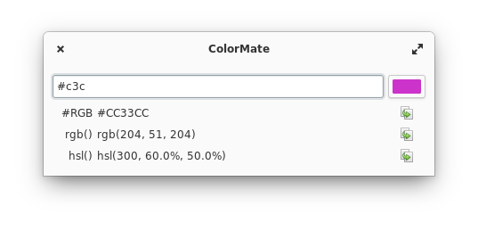

<p align="center">
  
</p>

<h1 align="center">ColorMate</h1>
<p align="center">Your friendly color mate</p>

<p align="center">
  
</p>

ColorMate is a small helper utility for web developers. You enter a color (e.g. in `#RGB` format) and ColorMate
gives you the representation in `rgb()` and `hsl()` formats.

## Built for elementary OS

While ColorMate will happily compile on any Linux distribution, it is primarily
built for [elementary OS].

[][appcenter]

## Developing and building

Development is targeted at [elementary OS]. If you want to hack on and
build ColorMate yourself, you'll need the following dependencies:

- libgranite-dev
- libgtk-3-dev
- meson
- valac

You can install them on elementary OS with:

```shell
sudo apt install elementary-sdk
```

Run `meson build` to configure the build environment and run `ninja install`
to install:

```shell
meson build --prefix=/usr
cd build
sudo ninja install
```

Then run it with:

```shell
com.github.ckruse.ColorMate
```

Since ColorMate is flatpack ready you alternatively can install [GNOME Builder](https://wiki.gnome.org/Apps/Builder),
open the project and hit on „Run“.

[elementary os]: https://elementary.io
[appcenter]: https://appcenter.elementary.io/
